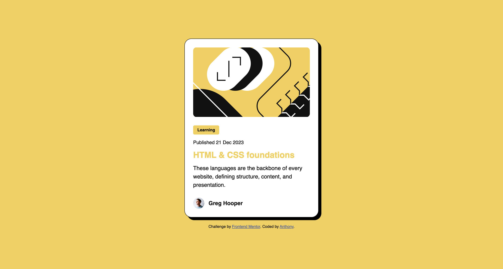
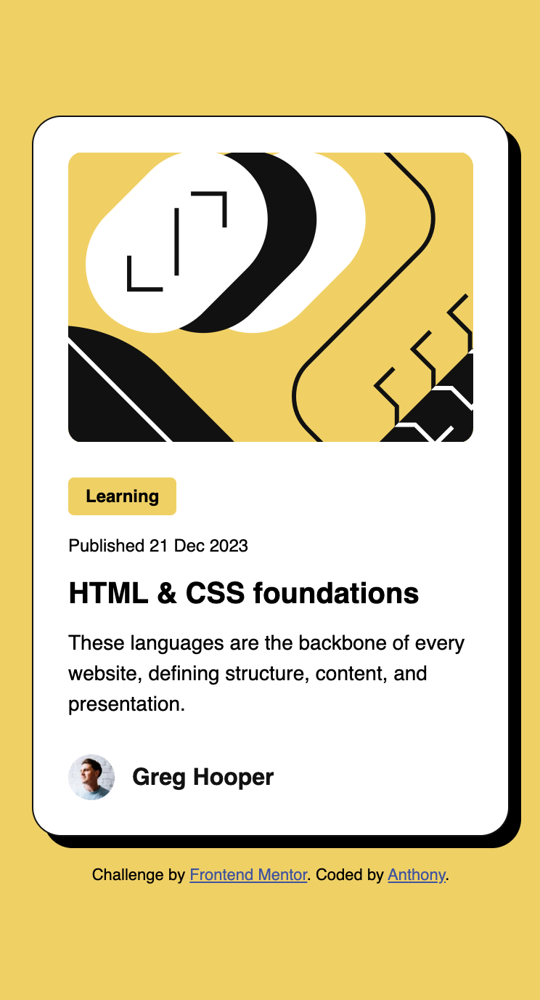

# Frontend Mentor - Blog preview card solution

This is a solution to the [Blog preview card challenge on Frontend Mentor](https://www.frontendmentor.io/challenges/blog-preview-card-ckPaj01IcS). Frontend Mentor challenges help you improve your coding skills by building realistic projects.

## Table of contents

- [Overview](#overview)
  - [The challenge](#the-challenge)
  - [Screenshot](#screenshot)
  - [Links](#links)
- [My process](#my-process)
  - [Built with](#built-with)
  - [What I learned](#what-i-learned)
  - [Continued development](#continued-development)
  - [Useful resources](#useful-resources)
  - [AI Collaboration](#ai-collaboration)
- [Author](#author)

## Overview

### The challenge

This project is a blog preview card with responsive design that works on both mobile and desktop. Users should be able to:

- See hover and focus states for all interactive elements on the page

### Screenshot

### Links

- Solution URL: [Add solution URL here](https://your-solution-url.com)
- Live Site URL: [Live Site](https://wizkid0107.github.io/FEM-blog-preview-card/)

## My process

### Built with

- Semantic HTML5 markup
- CSS custom properties
- Flexbox
- CSS `clamp()` for responsive typography and layout
- Mobile-first workflow

### What I learned

One of the biggest things I learned was using `clamp()` for responsive design. Before using it I was overthinking how it worked, but once I understood the min, preferred, and max values it made a lot of sense. The preferred value uses a relative unit like `vw` so the value scales fluidly between the min and max.

I also learned why setting `height: 100vh` on the body is necessary when using flexbox to center content. Flexbox only takes up the space it needs, so without `100vh` the body has no height to center within. Setting it to `100vh` gives flexbox the full viewport height to work with.

Another thing that clicked was knowing *when* to use certain HTML elements — for example using a `` for a category label like "Learning" instead of a `
` tag, since it carries no semantic meaning and isn't a paragraph of text.

### Continued development

I want to continue improving my understanding of responsive design and when to use specific HTML elements. Knowing *what* an element is and knowing *when* to use it are two different skills, and I want to keep building that judgment through more projects.

### Useful resources

- [MDN Web Docs - clamp()](https://developer.mozilla.org/en-US/docs/Web/CSS/clamp) - This helped me understand how `clamp()` works with min, preferred, and max values.
- [Clamp Calculator](https://www.marcbacon.com/tools/clamp-calculator/) - Useful for calculating the preferred value when I know my min/max font sizes and viewport widths.

### AI Collaboration

I shared the project's `AGENTS.md` file with Claude and used it as a mentor throughout the challenge. I would ask questions about what to do and how to approach problems, but I made sure AI never wrote any code for me. The goal was to learn by doing — AI was there to guide me and explain concepts, not to give me answers.

## Author

- Frontend Mentor - [@WizKid0107](https://www.frontendmentor.io/profile/WizKid0107)
- LinkedIn - [Anthony Mendez](https://www.linkedin.com/in/anthony-mendez-497867366/)
